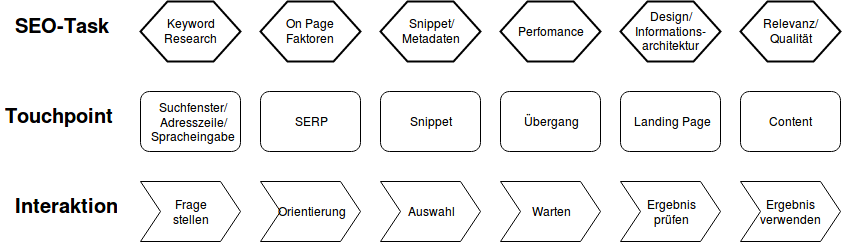
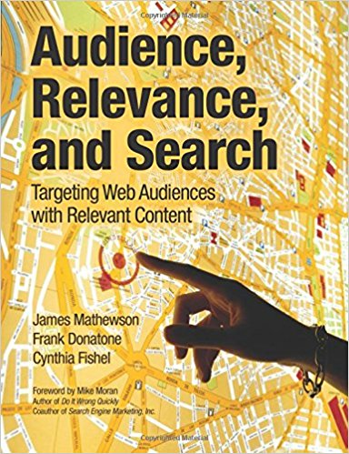
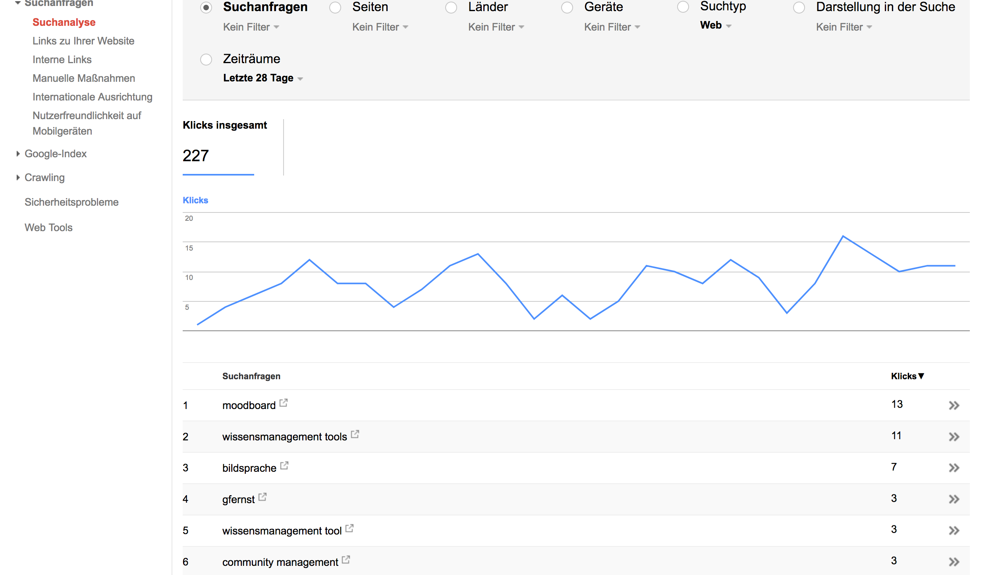
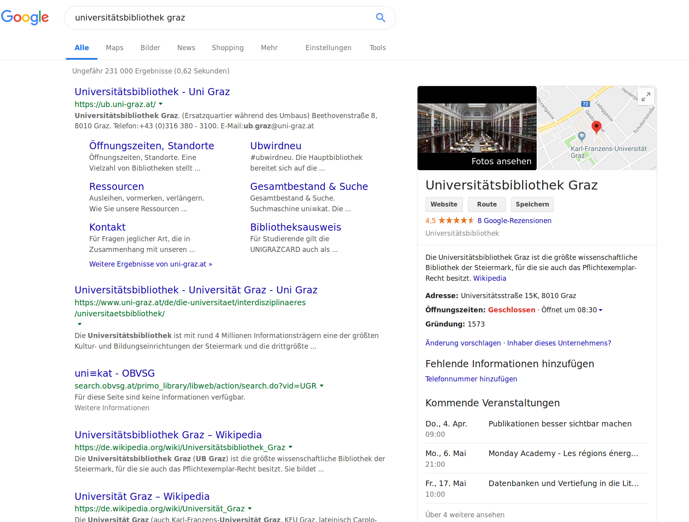

# Einleitung

## Ziele

- Verständnis von SEO als Teil user-orientierten Designs
- Verständnis allgemeiner Grundlagen von Suchmaschinen und SEO

<!--

## Ablauf

|||
|---|---|
|10:00 - 10:15| Vorstellungsrunde, Organisatorisches|
|10:15 - 11:30, 11:45 -13:00| Einführung/Theorie|
|14:00 - 15:00| Probleme der Teilnehmer|
|15:15 - 16:45| Gruppenarbeit: Entwicklung eines SEO-Konzeptes|
|17:00 - 18:00 | Zukunft der Suche|

-->

# Bedeutung der Suche

##

Quelle: [Dries Buytaert: The Big Reverse of the Web](https://dri.es/the-big-reverse-of-the-web)

<!--

##

- Suche, Sharen und Abonnieren sind die wichtigsten Zugänge zu Online-Inhalten
- Suche als wichtigster Zugang zu Online-Inhalten
- Durch die Suche steuern die Nutzen den Zugang zu Inhalten

##

- Suche wird ubiquitär
- Suche basiert zunehmend auf semantischer Analyse und Auswertung aller Arten von Daten

-->

# Findbarkeit als Service

## Ganzheitliches Verständnis von SEO

- Suche wird Gesamtvorgang erlebt
- Die Phasen beeinflussen sich gegenseitig
- Zeit und kognitiver Aufwand sind entscheidende Faktoren
- Die Qualität der Nutzererfahrung beeinflusst die SEO

## Wie läuft die Suche ab und wo liegen die größten Painpoints?

- Touchpoints: Wo findet die Interaktion statt?
- Interaktionen: Was tun, fühlen und denken die User?
- Backend: Was passiert bei Suchmaschine und Server?
- Optimierung: Wie kann ich den Prozess beeinflussen?

<!--
## Suche als Service {data-background="pics/search_as_service.png" data-background-size="contain"}
-->

## Suche als Service

## Vor der Suche: die Suchintention

- Situation
- Ort und Zeit
- Information, Orientierung, Transaktion

##

> It can be  helpful to think of queries as having one or more of the following intents.
> - Know query [...]
> - Do  query [...]
> - Website  query [...]
> - Visit-in-person  query, some of which are looking for a specific business or organization, some of which are looking for a category of businesses

[Google Search Quality Evaluator Guidelines](https://static.googleusercontent.com/media/www.google.%20com/de//insidesearch/howsearchworks/assets/searchqualityevaluatorguidelines.pdf)

# Sucheingabe

## Sucheingabe > Touchpoint

- Von der Google-Startseite zur Adresszeile: Suche wird zur Browserfunktion
- Spracheingabe: Suche als Teil des Universal Computing
- Finden ohne Suche: Suchintention wird antizipiert
- Beispiel: [21 Stats About Voice Search that you Never Knew](http://www.jodynimetz.com/21-stats-about-voice-search-that-you-never-knew)

## Sucheingabe > Interaktionen

- Natürliche Sprache und Operatoren (Advanced Search)
- Verarbeitet werden Text- (Bildeingabe) und Daten über den Client
- Suchvorschläge werden von der Suchmaschine interaktiv ergänzt

## Sucheingabe > Behind the scene

- Semantische Interpretation
- Aufruf der personalisierten Suchgeschichte für Suchvorschläge

## Sucheingabe > Optimierung

- Keyword-Research
- Synonyme/ Sprachliche Alternativen
- Verständnis der Intentionen

## Sucheingabe > Optimierung > Keywords

- Suchmaschinenoptimierung beginnt immer mit der Festlegung der Keywords bzw. der Fragen der User.
- Suche und Suchverhalten liefern die wichtigsten Daten über die User einer Website.

## Sucheingabe > Optimierung > Keyword-Clouds

- Vor dem Verfassen einzelner Inhalte sollten alle relevanten Keywords/Fragestellungen erhoben werden.
- Inhalte müssen über Keywords adressiert werden können
- Es dürfen sich nicht unterschiedliche Inhalte zum selben Keyword Konkurrenz machen.

## Grundlegend zu Inhalten und Suchvorgängen:

## Wichtigstes SEO-Instrument: Google Search Console

## Sucheingabe > Optimierung > Keywords finden

- Sucheingaben analysieren
- interne Suche
- Foren, Servicefragen u.ä.
- Soziale Medien
- Keyword Tools
- Akademisch: Literatur, Google Scholar

## Sucheingabe > Optimierung > Keywords finden

- [Kostenlose SEO Keyword-Tools](http://www.keyword-tools.org/)

- [Google Keyword Planer](https://adwords.google.com/aw/keywordplanner/home?ocid=88008662&__c=9405264038&authuser=0&__u=4127418278) (Anleitung, 2018 aktualisiert: [Google-Keyword-Planner: Die ultimative Anleitung | ❤ t3n](https://t3n.de/news/google-keyword-planer-anleitung-477330/))

- [Google Trends](https://trends.google.de/trends/?geo=DE)

- [Google Correlate](https://www.google.com/trends/correlate)

- Google Suggest (Entpersonalisiert: [Individuelle Suchergebnisse bei Google abschalten - computer.daten.netze :: feenders.de - berlin-kreuzberg](https://www.feenders.de/ratgeber/anwender/581-individuelle-suchergebnisse-bei-google-abschalten.html))

# Search Engine Result Page (SERP)

## SERP > Touchpoint

##

{ width=50% }

##

- Nach Relevanz geordnet
- Unterschiedliche Inhaltstypen
- Direkte Antworten (Answer Box)
- Knowledge Graph
- Position 0
- Visuelle Inhalte

## SERP > Interaktionen

- Auswahl eines Suchergebnisses, Scrollen, Weiterklicken
- Einschränkung der Suche
- Zurück zur Eingabe
- Wechsel mit Landing-Pages

## SERP > Behind the scenes: Die Power der Suchmaschine

- Interpretation der Sucheingabe
- Indizierung von Inhalten
- Bewerten der Relevanz
- Bewerten der Qualität

## SERP > Behind the scenes: Die Power der Suchmaschine

- Aggregation der Inhalte
- Herkömmliche und selbstlernende Algorithmen
- Content-Tester
- Semantische Interpretation, Cognitive Computing
- Ranking Signals

## SERP > Interpretation der Sucheingabe > Hummingbird

## SERP > Indizierung von Inhalten

<!--
<iframe width="844" height="425" src="https://www.youtube.com/embed/BNHR6IQJGZs" frameborder="0" allow="autoplay; encrypted-media" allowfullscreen></iframe>
-->

<https://www.youtube.com/embed/BNHR6IQJGZs>

## SERP > Bewerten der Relevanz und Qualität

[Search Quality rater guidelines](https://static.googleusercontent.com/media/www.google.com/de//insidesearch/howsearchworks/assets/searchqualityevaluatorguidelines.pdf) (PDF)

[Moz - Google Algorithm Change History](https://moz.com/google-algorithm-change)

[A Visual History of Google Algorithm Updates](https://blog.hubspot.com/marketing/google-algorithm-visual-history-infographic)

## SERP > Bewerten der Relevanz und Qualität

- [Content-Strategie statt SEO: Die Folgen von »Panda«](https://wittenbrink.net/lostandfound/content-strategie-statt-seo-die-folgen-von-panda/)

- [Wie bewertet Google die Qualität von Inhalten?—Material zu Panda - Lost and Found](https://wittenbrink.net/lostandfound/wie-bewertet-google-die-qualitaet-von-inhaltenmaterial-zu-panda/)

## SERP > Ranking Signals

[The Periodic Table of SEO Success Factors - Search Engine Land](https://searchengineland.com/seotable)

## SERP > Optimierung

KPI: Ranking

- Indizierbarkeit sicherstellen
- Erreichbarkeit und Gepflegtheit
- Zuordnung der Inhalte zu URLs
- Semantisch korrektes Markup

## SERP > Optimierung

- Keywords in URLs, Titeln und Überschriften
- Keywords in Navigations- und Inline-Links
- Keywords in der Beschreibung von Bildern und Medien
- Klares inhaltliches Profil

## SERP > Optimierung

- Trennen von Informations-, Orientierungs-  und Transaktionsinhalten
- Inhaltsqualität
- Aktualität
- Reputation und Verlinkung
- Vertrauenswürdigkeit der Quelle

## SERP > Optimierung > Indizierung

- Ist der Google-Bot als Crawler zugelassen? (robots.txt/User-Agent-Weiche)
- Wird die Webseite regelmäßig von Google gecrawlt?
- Werden wichtige Verzeichnisse oder Unterseiten blockiert?
- Existiert eine gültige sitemap.xml?
- Werden wichtige Inhalte der Webseite durch die robots.txt oder über die Robots-Meta ausgeschlossen?

(Nach: [SEO-Audit in 13 Schritten](https://t3n.de/news/seo-audit-13-schritte-rankings-optimieren-678475/))

## SERP > Optimierung > Indizierung

- Wieviele Seiten sind im Index?
- Wieviele Seiten sollten im Index sein?
- Sind die wichtigen Bereiche indexiert?
- Wieviele URLs in der Sitemap sind im Index?
- Werden wichtige Bereiche nicht über Google besucht?

(Nach: [SEO-Audit in 13 Schritten](https://t3n.de/news/seo-audit-13-schritte-rankings-optimieren-678475/))

## SERP > Optimierung > Zuordnung zu URLs

- Gibt es überflüssige doppelte Inhalte?
- Haben notwendige doppelte Inhalte `canonical`-Links?
- Gibt es mehr als eine Seite für dieselbe Abfrage?
- Wird die Indexierung verhindert, wo sie überflüssig ist?
- Sind die Sprachen korrrekt angegeben?

## SERP > Optimierung > Navigation

- Ist die Navigation verständlich?
- Gibt es eine Breadcrumb-Navigation?
- Sind alle wichtigen Unterseiten in vier Klicks erreichbar?
- Sind die Unterseiten richtig kategorisiert und verknüpft?
- Sind die URLs sprechend und nicht zu lang?

(Nach: [SEO-Audit in 13 Schritten](https://t3n.de/news/seo-audit-13-schritte-rankings-optimieren-678475/))

## SERP > Optimierung > Benennung der Inhalte

- Werden Titel oder Überschriften wiederholt?
- Gibt es generierte, nicht sprechende Titel oder Überschriften?
- Wird in Titeln oder Überschriften Marketing-Sprech verwendet?
- Gibt es zu lange Titel?
- Sind alle URLs sprechend/lesbar?

## SERP > Optimierung > Interne Links

- Gibt es Fehlerseiten?
- Gibt es verwaiste Seiten?
- Sind Seiten falsch weitergeleitet?
- Gibt es Widersprüche bei der Verlinkung?
- Gehen mehr als 100 Links von einer Seite aus?
- Gibt es wichtige Seiten mit zu wenig Links?
- Sind alle Klickpfade kurz genug?

(Nach: [SEO-Audit in 13 Schritten](https://t3n.de/news/seo-audit-13-schritte-rankings-optimieren-678475/))

## SERP > Optimierung > Semantisch korrektes Markup

- Ist das HTML der Seiten valide?
- Wird überflüssiges Markup zur Präsentation verwendet?
- Ist die Hierarchie der Überschriften korrekt?

## SERP > Optimierung > Google Richtlinien

[Varvy SEO tool and optimization guide](https://varvy.com/)

# Snippet

## Snippet > Touchpoint

> Gemeint ist die Kombination von der großen Überschrift, dem Teasertext und der URL der angezeigten Seite, die bei der Ergebnisliste einer Suchmaschine angezeigt wird.

[Snippet Definition | Gründerszene](https://www.gruenderszene.de/lexikon/begriffe/snippet)

---

## Snippet > Rich Snippet

> Rich Snippets sind erweiterte Suchergebnisse, die neben Titel, URL und Description weitere Elemente wie Bewertungen, zusätzliche Sitelinks oder sogar Bilder enthalten können.

[SEO-suedwest.de](https://www.seo-suedwest.de/3045-google-rich-snippets-auch-ohne-strukturierte-daten.html)

---

## Snippet > Entscheidung für den Klick

- URL und Headline
- Zitat
- Strukturierte Information

## Snippet > Interaktionen

- Scannen
- Klicken

## Snippet > Behind the Scene

- Auswahlkriterien für das Snippet
- Integration in den Knowledge Graph

## Snippet > Optimierung

KPI: Click Through Rate

- Sprechende URLs
- `description`
- Strukturierte Daten
- Zusammenfassungen in Listen

## Snippet > Optimierung > Google Hinweise

[Aussagekräftige Titel und Snippets für Suchergebnisse erstellen](https://support.google.com/webmasters/answer/35624?hl=de)

## Snippet > Optimierung > Structured Data

[Course  |  Search  |  Google Developers](https://developers.google.com/search/docs/data-types/course)

# Aufrufen der Landing Page

## Touchpoint: Übergang zur Landing-Page

- Zeit
- Einblendungen
- Aufbau nach dem Start

## Laden der Landing Page > Interaktionen

- Zurückklicken
- Abbruch der Suche

## Laden der Landing-Page > Behind the scene

- Generieren der Seite
- Caching der Seite (Accelerated Mobile Pages)
- Transportzeiten

## Laden der Landing Page > Optimierung

KPI: Ladezeit
- Ladezeit verkürzen
- Seitenaufbau steuern

## Laden der Landing Page > Optimierung > Werkzeuge

- Pingdom [Website speed test](https://tools.pingdom.com/)
- Google Pageload-Tool [PageSpeed Insights](https://developers.google.com/speed/pagespeed/insights/)

# Landing Page

## Landing Page > Touchpoint

- Above the Fold und Below the Fold
- Screen-/Viewport-Größe
- Scanbarkeit
- Wahrnehmbare Hierarchie

## Landing Page > Interaktionen

- Beschäftigung mit dem Inhalt
- Bouncen

## Landing Page > Behind the Scene

- Inhaltliches und visuelles Design entsprechen den Suchintentionen

## Landing Page > Optimierung

KPI: Bounce Rate

- Sofortiges Erkennen des gesuchten Inhalts
- Abstimmung auf Suchintention
- Relevanz-Signale, Kontextualisierung

# Inhalt

## Inhalt > Touchpoint

- Entspricht den Suchintentionen
- Interaktionsmöglichkeiten / Call-To-Actions

## Inhalt > Interaktion

- Rezeption der Inhalte, Transaktion oder Navigation
- Folgen von Links/Navigationssignalen
- Befolgen von Call-To-Actions
- Akademisch: Zotieren, Teilen, Speichern/Bookmarken, Vernetzung mit AutorInnen

## Inhalt > Behind-the-scene

- Redaktion
- Funktionalität
- Marketing

## Inhalt > Optimierung

KPIs: Verweildauer, Aktionen

- Qualität sicherstellen
- Navigationspfade ermöglichen
- Interaktionsmöglichkeiten/CTAs einfügen

<!--

# Praxis

## Suchintentionen bei Fachhochschulwebsites

Interessenten

Studierende

Bewerber um Jobs

Õffentlichkeit?

## Optimierung für Interessenten

- Navigationsinteresse
- Informationsinteresse
- Transaktionsinteresse

## SEO-Konzept:

- Zielgruppe

- Keyword-Cluster

- URL-Space/Navigation

- Content-Typen

- Zusammenfassungen

## Zielgruppe Studieninteressierte

- Gerry McGovern: [Putting current students first](https://de.slideshare.net/gerrymcgovern/putting-current-students-first)

- [Teenage Web UX: Designing Teen-Targeted Sites](https://www.nngroup.com/articles/usability-of-websites-for-teenagers/)

- [Fighting the Content Monster: Content Strategy for HigherEd von Brigitte Alice Radl auf Prezi](https://prezi.com/hthrikqe8qvj/fighting-the-content-monster-content-strategy-for-highered/)

## Links

[Pinboard: bookmarks for heinzwittenbrink tagged 'seo'](https://pinboard.in/u:heinzwittenbrink/t:SEO/)

[Pinboard: bookmarks for heinzwittenbrink tagged 'highered'](https://pinboard.in/u:heinzwittenbrink/t:HigherEd/)

# Zukunft der Suche?

-->
